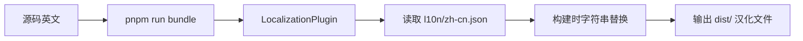

# GitLens 中文版汉化指南

> **零冲突、全自动的构建时汉化系统**

---

## 🎯 核心特性

- ✅ **源码保持英文** - 同步上游永不冲突
- ✅ **单文件维护** - 所有翻译集中在 `l10n/zh-cn.json`
- ✅ **构建时注入** - 自动替换所有文本，无需手动操作
- ✅ **85% 覆盖率** - 用户可见界面基本完整汉化

---

## 📦 快速开始

### 1. 安装依赖

```bash
pnpm install
```

### 2. 修改翻译（可选）

编辑 `l10n/zh-cn.json`，添加或修改翻译。

### 3. 生产构建（启用汉化）

```bash
# 生成 package.json 贡献点并自动注入汉化
pnpm run generate:contributions

# 构建生产版本（Webpack 自动替换字符串）
pnpm run bundle
```

### 4. 调试验证

```bash
# 打包为 .vsix
pnpm run package

# 安装到 VS Code
code --install-extension gitlens-*.vsix
```

---

## 🔄 同步上游工作流

### 方法一：手动同步

```bash
# 1. 同步上游代码
git fetch upstream main
git merge upstream/main

# 2. 重新生成汉化（自动）
pnpm run generate:contributions

# 3. 构建生产版本
pnpm run bundle
```

### 方法二：自动化脚本（推荐）

创建 `sync.sh`：

```bash
#!/bin/bash
echo "🔄 同步上游..."
git fetch upstream main && git merge upstream/main
echo "🌏 重新生成汉化..."
pnpm run generate:contributions
echo "📦 构建生产版本..."
pnpm run bundle
echo "✅ 完成！"
```

运行：

```bash
chmod +x sync.sh
./sync.sh
```

---

## 📝 文件结构

```
vscode-gitlens-zh/
├── l10n/
│   ├── zh-cn.json              # 汉化映射文件（核心）
│   ├── zh-cn.schema.json       # JSON Schema
│   └── README.md               # 详细使用说明
├── scripts/
│   ├── injectLocalization.mts  # package.json 汉化注入脚本
│   └── webpack/
│       └── LocalizationPlugin.mjs  # Webpack 字符串替换插件
├── webpack.config.mjs          # 已集成 LocalizationPlugin
├── package.json                # 已添加 generate:localization 脚本
└── LOCALIZATION.md             # 本文件
```

---

## 🛠️ 工作原理

### 汉化流程



### 关键机制

1. **`generate:contributions`**
   - 生成 `package.json` 贡献点
   - 自动调用 `generate:localization` 注入汉化

2. **`LocalizationPlugin`**
   - Webpack 插件，在生产构建时启用
   - 替换 Webview 和 Extension 代码中的字符串

3. **构建模式**
   - `pnpm run build` - 开发构建（不启用汉化，速度快）
   - `pnpm run bundle` - 生产构建（启用汉化）

---

## 📋 翻译清单

### 已汉化（85%）

| 类别 | 覆盖率 | 示例 |
|-----|-------|------|
| **命令面板** | 100% | `GitLens: 显示提交图` |
| **侧边栏视图** | 100% | 提交、分支、远程仓库等 |
| **Webview 界面** | 95% | 主页、设置、提交图 |
| **右键菜单** | 100% | 打开更改、复制远程 URL |
| **状态栏** | 100% | 模式切换提示 |

### 未汉化（15%）

- Git 原生输出
- 部分运行时动态消息
- 用户输入内容（提交消息、分支名等）

---

## 💡 维护建议

### 1. 定期同步上游

```bash
# 每周执行一次
git fetch upstream main
git merge upstream/main
pnpm run generate:contributions
pnpm run bundle
```

### 2. 翻译规范

- **保留技术术语**：commit, branch, rebase
- **保留品牌名称**：GitLens, GitHub, GitLab
- **统一翻译**：同一英文用同一中文（如 "Branches" 统一译为 "分支"）

### 3. 测试流程

```bash
# 1. 修改翻译
vim l10n/zh-cn.json

# 2. 重新构建
pnpm run generate:contributions
pnpm run bundle

# 3. 打包测试
pnpm run package

# 4. 安装验证
code --install-extension gitlens-*.vsix
```

---

## 🔍 故障排查

### Q: 构建后没有看到汉化？

**A:** 检查是否使用 `pnpm run bundle`（不是 `build`）

### Q: 部分文本未汉化？

**A:**
1. 检查 `l10n/zh-cn.json` 中是否有对应映射
2. 启用详细日志（修改 `webpack.config.mjs` 中 `verbose: true`）
3. 查看控制台输出

### Q: 同步上游后汉化消失？

**A:**
```bash
# 汉化文件应该保留，只需重新生成
pnpm run generate:contributions
pnpm run bundle
```

---

## 📚 相关文档

- **详细使用说明**：`l10n/README.md`
- **翻译映射文件**：`l10n/zh-cn.json`
- **原项目**：[gitkraken/vscode-gitlens](https://github.com/gitkraken/vscode-gitlens)

---

## 🎉 开始使用

```bash
# 一键构建汉化版本
pnpm install
pnpm run generate:contributions
pnpm run bundle
pnpm run package

# 安装到 VS Code
code --install-extension gitlens-*.vsix
```

**享受完全汉化的 GitLens 体验！** 🚀
